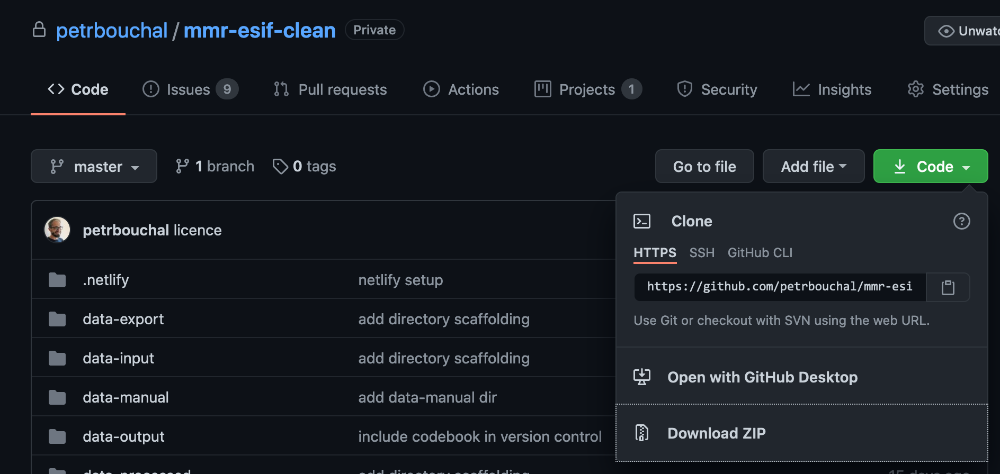

Tento dokument popisuje krok za krokem jak kód stáhnout, nachystat na spuštění a spustit.

Výstup předchozího spuštění skriptu (tj. webové logy procesu a dokumentace) jsou dostupné na <https://esif-data-cleaning.netlify.app/>.

# Instalace R

Co je třeba:

- R 4.X, poslední verze na: https://cran.r-project.org/
- RStudio https://rstudio.com/products/rstudio/
- Rtools 4.X - https://cran.r-project.org/bin/windows/Rtools/ - systémové nástroje potřebné pro instalaci některých balíků v R, my je potřebujeme kvůli nástrojům na analýzu geografických dat

# Licence

viz soubor LICENSE.

# Přístup ke kódu

Kód je v soukromém git repozitáři na Githubu; k přístupu je potřeba Github účet a zpřístupnění vlatníkem (momentálně Petr Bouchal, <pbouchal@gmail.com>).

# Stažení kódu

> Tyto kroky je potřeba udělat jen jednou.

2 možnosti:

1. Pokud pracujete s gitem, pak

```
git clone https://github.com/petrbouchal/mmr-esif-clean/
```

2. Jinak lze stáhnout jako ZIP z <https://github.com/petrbouchal/mmr-esif-clean/archive/master.zip> a rozbalit na libovolné místo, popř. stáhnout přes webové rozhraní:  

Veškerý kód určený k “ostrému” využití je v branchi `master`.

# Otevření projektu

Adresář lze otevřít jako projekt v RStudiu. To lze udělat otevřením souboru `mmr-esif-clean.Rproj`.

Bude ale fungovat i v R v příkazové řádce.

> Poznámka: všechny adresářové cesty v dokumentaci i kódu jsou relativní k adresáři projektu.

# Obnova prostředí (balíky R)

> Tyto kroky je potřeba udělat jen jednou po stažení kódu z Githubu

Po otevření projektu v RStudiu, popř. spuštění R v terminálu v adresáři by měla automaticky proběhnout instalace balíku `renv`, který udržuje fixované prostředí balíků potřebných pro analýzu ve správných verzích.

Pokud by v tomto kroku došlo k chybě, lze balík nainstalovat příkazem `install.packages(renv)`  a následně pro jistotu aktualizovat záznam prostředí pro nainstalovanou verzi balíku `renv` příkazem `renv::upgrade()`.

Následně je třeba v adresáři vytvořit kopii prostředí (sady balíků) potřebného pro spuštění kódu:

```
renv::restore()
```

Pokud v této fázi nastane neřešitelná chyba, lze správu prostředí vypnout (`renv::deactivate()`) a balíky nainstalovat ručně. Stav balíků při posledním úspěšném buildu lze dovodit ze souboru `renv.lock`, popř. v [této části webového odrazu dokumentace](https://esif-data-cleaning.netlify.app/dev.html).

# Spuštění úprav dat

## Vstupní data

1. vytvořte v adresáři `data-input` podadresář, pojmenujte jakkoli a vložte do něj excelové (`.xlsx`) soubory - pro každý OP jeden. Název každého souboru by měl být stejný jako v původní sadě, s mezerami, tj. např. `"OP Z.xlsx"`
2. vložte celou cestu k těmto souborům (tj. např. `data-input/nova_data`) do parametru `input_dir` v souboru `config.yml`.
3. Vložte novou verzi dat o projektech podle chráněného území, pokud je: přepište soubor `data-input/CHKONP.xlsx` novým, popř. vložte pod novým názvem a upravte parametr v `input_chu_xlsx`

## Spuštění skriptů

Celý proces naráz lze spustit skriptem `build-and-render.R`. Tento skript:

- spustí R skripty na načtení a přípravu vstupních dat a metadat
- spustí všechen kód obsažený v `.Rmd` souborech a vygeneruje z toho vyplývající webovou prezentaci

Pro snadnější spuštění z příkazové řádky existuje i skript `build-and-render.sh`, která udělá totéž bez nutnosti spouštět R nebo RStudio.

### Začlenění manuálně rozřešených projektů

V současném stavu je v datech cca 119 projektů, u kterých jsou uvedeny vnitřně nekonzistentní geografické údaje, např. ukazují realizaci projektu zároveň v kraji a zároveň v obci, která ale není v daném kraji.

U těchto projektů je třeba manuálně rozhodnout, který údaj se použije. 

TO DO

Jak na to:

1. Spusťte vše podle návodu výše
1. Otevřete soubor `data-output/prj_nehierarchicke-vse.xlsx`
1. U každého projektu rozhodněte, které údaje (tj. řádky) se mají použít a u těch vložte do sloupce `vybrat` hodnotu `TRUE` nebo jen `T`. Ostatní můžete nechat prázdné (tj. netřeba vkládat `FALSE`).
	- Můžete se rozhodnout, že použijete víc údajů (např. lokalizaci na kraj a ORP, i když spolu nesouvisí); skript následně projekt rozpadne do všech obcí, které spadají do vybraných území.
	- **Pokud u nějakého projektu nevyberete ani jeden řádek (tj. nikde neuvedete `TRUE` do sloupce `vybrat`, nebo ve všech řádcích vložíte `FALSE`), projekt se ve výstupních datech vůbec neobjeví**
1. Pro rozhodování může pomoct mapový nástroj v souboru `docs/widget.html` nebo na <https://esif-data-cleaning.netlify.app/widget.html>.
1. Výsledný excelový soubor uložte do `data-manual/prj_nehierarchicke-vybrano.xlsx`
1. (Pokud chcete rozřešené projekty brát z jiného souboru, upravte hodnotu `input_resolved_xlsx` v `config.yml`)
1. Spusťte znovu Rmd skripty s názvy začínajícími 09 a 10 - tím se data těchto projektů ropzadnou na obce vybraných území a nové rozpady se začlení do finálního Arrow exportu.
1. Pokud potřebujete excelové exporty, spusťte ještě `export-excel.R`.

#### Při opakovaném spouštění

Pokud 

### Co se kde děje

Celé workflow není centrálně orchestrováno ani cacheováno žádným workflow nástrojem á la `make`; jde jednoduše o posloupnost skriptů, které si mezivýstupy předávají přes datové exporty v adresářích `data-input` (hrubá externí data) a `data-processed` (zpracovaná data). Každý skript poběží sám o sobě, ale předpokládá přítomnost mezivýstupů předchozích skriptů v těchto adresářích. 

R skripty zmíněné v `build-and-render.R` načítají vlastní ESIF data a externí data a metadata z ČSÚ, ČÚZK a Státní pokladny Ministerstva financí. Jako mezivýstup ukládají stažené datové soubory v `data-input` a `parquet`/`Rds` obraz vstupních ESIF dat a některých metadat v `data-processed`. 

Explorace, validace i transformace a export dat se dějí v Rmd skriptech, které zároveň provádí datové úkony a exporty a zároveň generují webový výstup. (To není ideální setup pro případné produkční nasazení, ale je funkční pro interaktivní práci s jednotlivými částmi workflow.)

Mezivýstupy se běžně přepisují, tj. při novém spuštění vzniknou nové, ale v několika případech jsou znovuvyužity, pokud existují, aby se ušetříl čas. Zcela čisté spuštění tedy vyžaduje vymazání obsahu adresářů `data-input` (s výjimkou adresáře s excelovými vstupy) a adresáře `data-processed`.

Celkové pořadí spouštění odpovídá skriptu `build-and-render.R`.

Rmd skripty, které společně tvoří webovou prezentaci a zároveň provádějí datovou validaci a transformaci, se společně v abecedním pořadí spustí příkazem `rmarkdown::render_site()` (též zahrnut v `build-and-render.R`), ale lze je spouštět i samostatně přes `rmarkdown::render("xxx.RMd")` nebo tlačítkem `Knit` v Rstudiu.

## Výstupy

1. webová prezentace v adresáři `docs`: lze ji otevřít lokálně v prohlížeči poklepáním na soubor `index.html`. 
2. data v Arrow datasetu (formát parquet) v adresáři `data-output`
3. data v Excelu v adresáři `data-export`

## Publikace výsledné webové prezentace

Webovou prezentaci v adresáři `docs` lze snadno zveřejnit kdekoli. V souboru `.netlify/state.json` je nastavení použitelné pro rychlý deploy na netlify; pokud bude potřeba stránku aktualizovat na Netlify, můžu subdoménu na někoho převést, nebo bude třeba tento soubor smazat a navázat projekt na novou subdoménu na Netlify.

Konfigurace a struktura webové prezentace jsou upraveny v `_site.yml`; viz [dokumentaci k rmarkdown websites](https://bookdown.org/yihui/rmarkdown/rmarkdown-site.html#site-configuration).

## Opakované spuštění

Zcela nové spuštění načisto vyžaduje:

- správně nastavit cestu ke vstupním excelovým souborům, viz výše
- vyprázdnit adresáře:
	- `data-input` vyjma adresáře se vstupními excely
	- `data-processed`
	- `data-output`
	- `data-manual` **jen pokud nechceme využít předchozí manuální rozřešení nekonzistentních projektů**

Tyto kroky nechávám jako manuální, aby nedocházelo k nechtěnému mazání výstupů nějakým skriptem.

